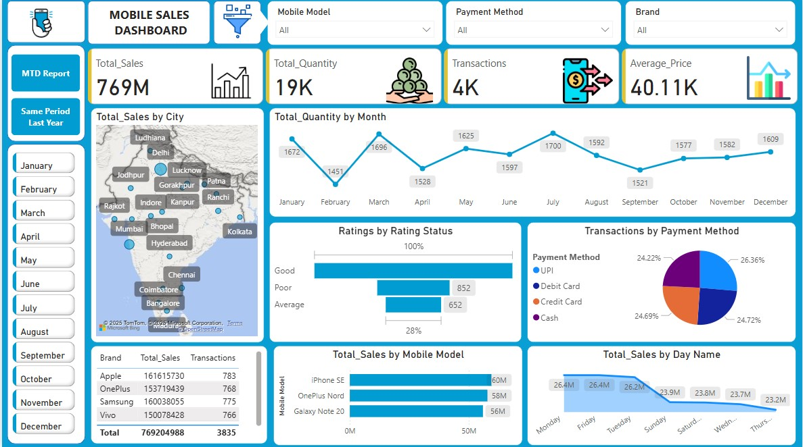
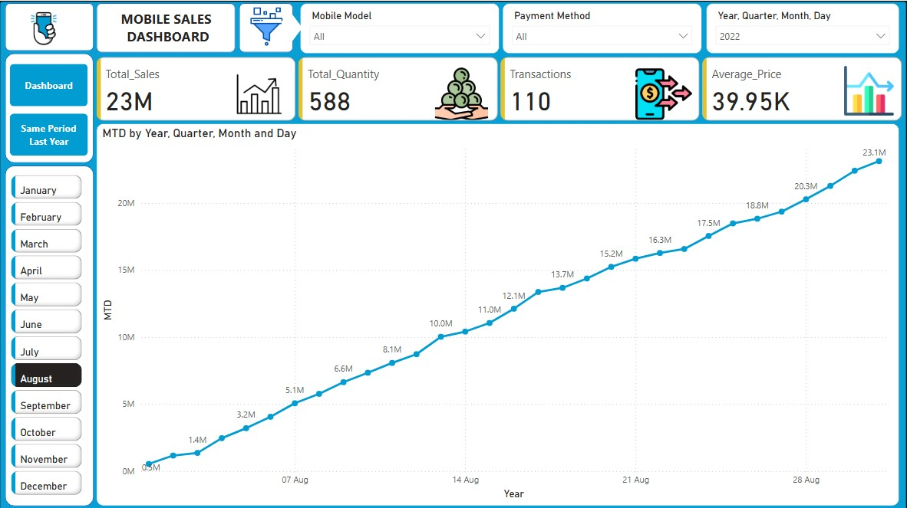
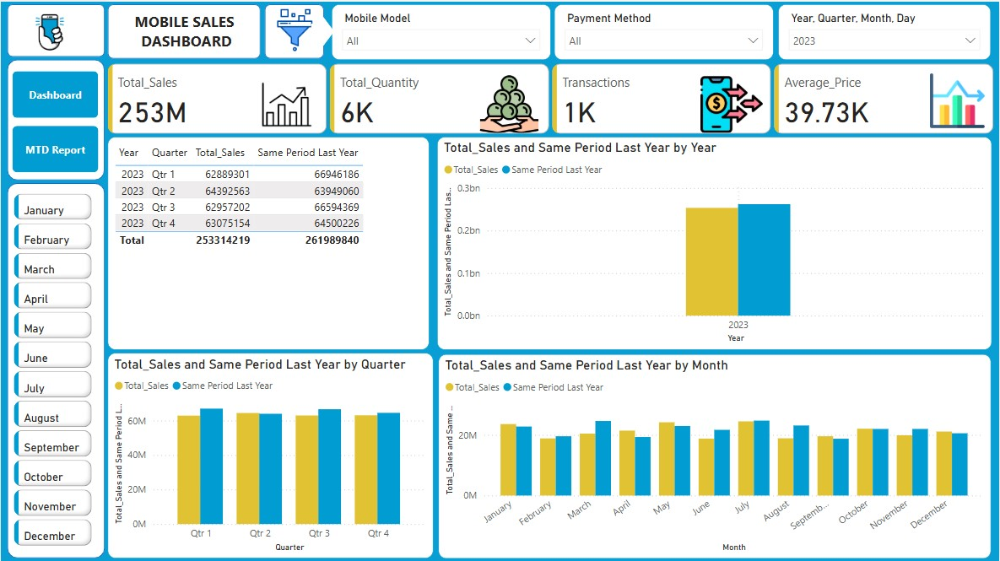

# 📱 Mobile Sales Dashboard - Power BI Project

This repository contains an interactive **Mobile Sales Dashboard** built using **Power BI**. The dashboard provides a comprehensive view of mobile sales performance, customer behavior, and payment methods.

---

## 📊 Key Features

- 🔄 Real-time data updates
- 📅 Monthly sales filtering
- 👥 Gender-wise revenue and customer count
- 💳 Payment method analysis
- 📈 Daily revenue trend visualization
- 📦 Quantity sold by month and gender

---

## 🗂 Project Files

```
📁 Mobile-Sales-Dashboard/
├── Mobile Sales Data.xlsx        # Raw sales dataset
├── Mobile_Sales_Dashboard.pbix  # Power BI dashboard file
├── Screenshots/                 # Optional: dashboard images
│   └── dashboard-preview.png
└── README.md                    # Project overview file
```

---

## ⚙️ Tools & Technologies

- Power BI Desktop
- DAX (Data Analysis Expressions)
- Power Query (ETL)
- Microsoft Excel (Data Source)

---

## 📌 Insights Delivered

- **Total Revenue:** ₹40.22M+
- **Total Quantity Sold:** 50,000+
- **Average Product Price:** ₹807.51
- **Top Payment Methods:** Online, Credit Card, Cash, Debit Card
- **Gender-Based Customer Insights**
- **Time-Based Trends (Daily, Monthly, Quarterly)**

---

## 📷 Dashboard Preview





---

## Live Demo

Explore the live project here: [Mobile Sales Dashboard - Power BI Project Report](https://app.powerbi.com/groups/me/reports/e6ab2faa-e0fd-4d19-9058-c289ec623626/992aac1a083480728678?experience=power-bi)

---

## 🚀 How to Use

1. Clone the repository:
   ```bash
   git clone https://github.com/yourusername/mobile-sales-dashboard.git
   ```

2. Open the `.pbix` file in **Power BI Desktop**.

3. Load or refresh the data from `Mobile Sales Data.xlsx`.

4. Explore the interactive dashboard using slicers and visual filters.

---

## 👨‍💻 Author

**Surjeetsinh Nandkumar Thakur**  
Final Year CSE Student 

